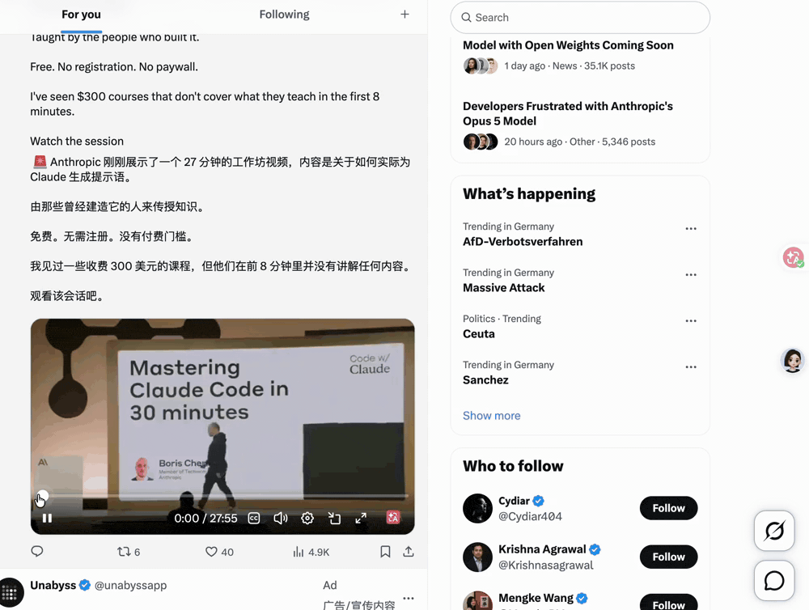

<div align="center">

# watch-anything · 看不完的视频，让 AI 替你看懂

**丢一个 X / YouTube / B站 视频链接进来，几分钟后拿到一张一眼看完的中文卡片
（摘要 + 要点 + 金句中英对照）+ 完整解读 + 全文中译，还能就着它追问。**

**Drop in an X / YouTube / Bilibili video link, and minutes later get a glanceable card
(summary + key points + bilingual highlights) + a full breakdown + a full Chinese translation,
all of which you can then ask questions about.**

它是 [read-anything](https://github.com/heyuxuan0209/read-anything) 的姊妹：
**read 管读文字，watch 管看视频。**



<sub><b>⚠️ About the GIF above</b>: that browser side panel is <b>my own knowledge workbench</b>, and it is <b>not open source</b>.<br>
What's open source is watch-anything, a <b>skill</b> — you drop a link in Claude Code / Codex, it fetches,
transcribes and produces a Chinese card; the output is markdown (see the real example under "How to use").<br>
So what you get by starring: <b>fetching + caption-less transcription + Chinese card breakdown + follow-up Q&A + optional Feishu push</b>.
What you don't get: this side-panel UI, the inspiration library.<br>
The GIF shows: an X tweet with a 28-minute video (Anthropic's official prompt workshop) → audio downloaded and transcribed → Chinese card.</sub>

</div>

**English** · [简体中文](README.zh-CN.md)

---

## What is this

Your bookmarks are probably full of videos you "meant to watch someday" — a forty-minute
English tech talk, a tweet with a video, a podcast conversation, a caption-less long video on
Bilibili... and they just sit there collecting dust, too long to finish, too much to get through.

watch-anything is a **Claude Code / Agent skill**: drop in a video link, it first fetches the
content, transcribes the audio track into text (if there are no captions), then has your AI produce
a Chinese card breakdown, with the output landing as markdown in your own knowledge base. The whole
thing happens inside your agent — no switching back and forth between a dozen web tools.

## The specific pain it solves

- **Bookmarked it but no time to watch** → in minutes you get a card that lets you "get it without watching the original"
- **English / caption-less videos, where other summary tools just give up** → auto-downloads the audio track and transcribes, then produces a Chinese breakdown
- **Want to dig into details** → chat over the transcript, answers grounded only in the source, no fabrication
- **Watch and forget, scattered everywhere** → the breakdown lands as markdown, accumulating into your own system

## The killer feature: understand even without captions

Most "video summary" tools rely on the platform's **existing captions**, and choke on videos without
them. The core of watch-anything is a complete transcription fallback chain, where each level
automatically drops down to the next on failure:

```
Video captions (fast, accurate)  →  Groq cloud whisper (tens of seconds, nearly free)  →  local faster-whisper (zero API cost, never leaves your machine)
```

If there are captions, use them; if not, download the audio track and transcribe. With `GROQ_API_KEY`
configured it goes through the cloud; without it, transcribe locally (audio never leaves your machine).
This is also its real value relative to read-anything: read currently only grabs X as **text**, and
**does not download and transcribe video**; watch fills in exactly that gap.

## Why a skill, not a browser extension

Because the killer feature "caption-less video transcription" needs `yt-dlp` + `whisper` — **these
can't run inside a browser extension**. A skill is the only form that is "zero-server + full-capability":
the host Claude Code is itself the large model, and the skill just provides the fetching / transcription
scripts, leaving translation and interpretation to the host agent. So it doesn't need you to stand up
your own backend — clone it and it just works.

## Let your coding agent install it for you

You don't need to understand any of the code, or even use the command line yourself. Paste this
message to Claude Code / Codex / Cursor / any coding agent:

> Download this for me and walk me through installing and configuring it, step by step, in plain
> language. https://github.com/heyuxuan0209/watch-anything

It should: clone the repo into the right skills directory → check Node 18+ and install `yt-dlp` →
help you decide whether you want cloud transcription (Groq key) or local-only → run one real video
end to end so you can see it work.

**Never paste an API key into an AI chat, a source file, a screenshot, or a public message.** Put keys
into your own shell config yourself; your agent can point at the right line without ever seeing the value.

If you'd rather do it by hand, read on.

## How to use

**Install** (Claude Code, one command):

```bash
git clone https://github.com/heyuxuan0209/watch-anything.git ~/.claude/skills/watch-anything
```

Once installed, in any session just drop a video link and say "break this down / what's it about" to
trigger it. Update with `git -C ~/.claude/skills/watch-anything pull`. To install it only for a
specific project, clone it into that project's `.claude/skills/watch-anything`.

**It looks like this in use** (taking the tweet in the GIF above as an example, real link
[x.com/Krishnasagrawal/status/2084314878576365906](https://x.com/Krishnasagrawal/status/2084314878576365906)):

```
You: https://x.com/Krishnasagrawal/status/2084314878576365906 what's this video about
It: (fetch-x gets the tweet → finds a 28-min video → yt-dlp downloads the audio track → Groq/local whisper transcribes → produces card)
```

The card that comes out (full version in the GIF at the top) looks roughly like this:

```
# Anthropic official prompt workshop: how to really get the most out of Claude Code
> Krishna Agrawal（@Krishnasagrawal）| X | 2026-08-03 | 视频转写（语音听写，可能有少量误差）

【摘要】
Anthropic 团队成员 Boris 在一场 28 分钟免费研讨会里，系统讲解如何真正用好 Claude Code
这个 Agent 化编码助手：从环境配置、代码库上下文，到让它记住特定行为、写入 CLAUDE.md……

【要点】
- 给 Claude 一个能自我检查的反馈闭环（跑测试、Puppeteer 截图），它会自动迭代，比一次成型好得多
- 通过项目里的 CLAUDE.md 共享常用命令 / MCP 工具 / 斜杠决策，把团队工具接成 MCP 供它调用
- 用好快捷键：Shift+Tab 进自动接受、Esc 随时安全中断、输入「#」让它记住特定行为
- Code CLI 可当超级智能的 Unix 工具接进管道，适合 CI 故障响应、日志分析等进阶场景

【金句】
> 得到你想要的结果的最简单办法，是让它先思考。所以，先头脑风暴想法、制定计划，然后再写代码。
> The easiest way to get what you want is asking it to think first. So, brainstorm ideas, make a plan, and only then write the code.

> 给它一个能看到自己成果的方式，它就会迭代、越做越好。
> Give it a way to see the results of its own work, and it will iterate and get much better.

—— 全稿 ——

**一句话核心**：把 Claude Code 当会自查的同事用，而不是当补全工具。

## 讲述脉络
### 开场：为什么大多数人用不好它 [00:40]
（按原片实际结构一节一节走完，还原他是怎么把这件事讲清楚的——论证过程、
为什么这么说、中间的转折和让步。这一节是全稿主体，1500~3000 字）

### 反馈闭环：让它自己看见结果 [06:12]
…

## 关键案例与细节   ## 简版结构图   ## 局限与存疑
```

**Not just Claude — any agent that can run shell commands works** (Codex / Cursor / Gemini CLI /
WorkBuddy / OpenClaw…): the core logic all lives in `PLAYBOOK.md` (a pure-markdown playbook) +
`scripts/` (ordinary command-line tools, JSON in/out), depending on no Claude-specific features. In
every case the hookup is **clone + paste a paragraph into your agent's instruction file**:

```bash
git clone https://github.com/heyuxuan0209/watch-anything.git ~/.agent-skills/watch-anything
```

Paste this into the file below (each tool just differs by file name):

```markdown
## watch-anything（视频/推文 → 中文卡片解读）
当我丢 X / YouTube / B站 / 视频链接并要求「解读 / 看懂 / 讲了啥 / 转写」时，
按 ~/.agent-skills/watch-anything/PLAYBOOK.md 执行（路由、转写降级链、卡片格式、降级规则都在里面）。
```

| Agent | Instruction file |
|---|---|
| Codex CLI | `~/.codex/AGENTS.md` (global) or project-root `AGENTS.md` |
| Cursor | Create a new rule under the project's `.cursor/rules/` (or the legacy `.cursorrules`) |
| Gemini CLI | `~/.gemini/GEMINI.md` (global) or project-root `GEMINI.md` |
| WorkBuddy / others / can't be bothered to configure | Paste the paragraph above into its instruction/rules file; or each time just say "handle this link per ~/.agent-skills/watch-anything/PLAYBOOK.md" |

## What it can chew on

- **X tweets / tweet videos**: login-free fetch of the body + quoted tweets + media list; auto-downloads and transcribes audio if there's a video
- **YouTube**: captions first, local/cloud transcription if no captions
- **Bilibili**: same as above
- **Other video links**: tries whatever yt-dlp supports

English videos directly produce a Chinese breakdown (no need to translate first and then read). Images
/ video frames are P0 not parsed — it only covers "what was said," and doesn't pretend to have watched
"what's in the frame."

## Card format (default) + three alternatives

The default output has **three layers**:

| Layer | What it is | What it's for |
|---|---|---|
| **Card** | 【Summary】3 sentences · 【Key points】3-6 items · 【Highlights】bilingual with timestamps | Decide in thirty seconds whether to read on |
| **Deep read** | 【Narrative arc】walked section by section following the original's actual structure + 【Key examples and details】+【Skeleton outline】+【Limits and open questions】 | Understand it fully without watching the original |
| **Full Chinese translation** | The whole thing translated paragraph by paragraph, translated not commented on | Verifying, quoting, searching — the foundation, never skipped |

The card is the entry point, the deep read is the substance, the translation is the foundation. The deep
read targets 1,500–3,000 Chinese characters, more for long videos; if the material is already in Chinese
(Bilibili, a Chinese podcast) the third layer is simply the raw transcript, not a pointless "translation".

| What you want | Which template to use |
|---|---|
| Card + full breakdown (default) | Card breakdown `card.md` |
| **A write-up that replaces watching the original** | **Deep read `deep-read.md`** |
| Judge in 30 seconds whether it's worth watching | Quick scan `brief.md` |
| Podcast / conversation, split views by person | Interview breakdown `interview.md` |
| X thread / long tweet | Thread breakdown `thread.md` |
| how-to / tutorial / hands-on video, broken into actionable steps | Tutorial breakdown `tutorial.md` |
| Launch event / new product / industry news video | Launch breakdown `news.md` |

**Templates can all be edited and added to**: every .md in `templates/` can be deleted or changed, drop
one of your own in and it's a new template, just say "use my xx template." These templates are clean,
general-purpose perspectives, containing no personalized / productized content — if you want the
breakdown to fit your own focus (e.g. "implications for my product"), just add a template yourself.

## Output destinations: where the breakdown lands

By default it lands as local markdown. `integrations/` is the layer for sending it somewhere else.

**Feishu / Lark** is built in, in two tiers: a group-bot card (30 seconds to set up, pushes a card into
a chat) and a cloud doc (5 minutes, imports the full breakdown as a Feishu doc you can search, edit and
share). Configure both and it creates the doc first, then puts the doc link inside the card.
**Skipping it changes nothing** — this is a bonus, not a prerequisite.

Of the three layers above, **the cloud doc gets the whole thing (all three layers), while the group card
only gets the card layer plus a table of contents for the narrative arc** — a Feishu card is capped at
30KB, which a tens-of-thousands-of-characters translation blows right past. With only the webhook
configured, the card says where the rest of it went; to read the full text inside Feishu you need the
cloud doc tier.

```bash
node scripts/push-feishu.mjs --title "Title" --file card.md --full-file full.md --source-url "<original link>"
```

Setup lives in [`integrations/feishu.md`](integrations/feishu.md), including the potholes hit in practice.

**Want Notion / Obsidian / Slack instead?** That file is the template: the script only does two things —
reshape the markdown into what the target platform wants, then POST it. Writing another one is about an
evening's work, or hand the file and the script to your coding agent and say "write me a Notion one."

## One principle: if it can't be seen, say so

Can't fetch the tweet, audio didn't transcribe, frame not parsed — it tells you all of this truthfully,
and never uses incomplete material to fabricate a plausible-looking breakdown. Transcription output is
labeled "may contain dictation errors," and quoted highlights remind you to check against the original
video. Every sentence you read is traceable.

## Dependencies

| Dependency | Required? | Purpose |
|---|---|---|
| Node.js 18+ | Required | Runtime for the four .mjs scripts (zero npm dependencies) |
| curl | Required (ships with the system) | Network layer, natively supports proxy environment variables |
| yt-dlp | Required for the video route | Pulls captions + downloads audio track (`brew install yt-dlp`); without it, only text-only X tweets can be handled |
| GROQ_API_KEY | Optional | Groq cloud whisper transcription (fast, nearly free, ≤25MB); get one free at [console.groq.com](https://console.groq.com) |
| faster-whisper | Optional | Local transcription fallback (`pip install faster-whisper`, first run auto-downloads a ~460MB model) |
| FEISHU_WEBHOOK / FEISHU_APP_ID | Optional | Output destination: push breakdowns to a Feishu/Lark group card or cloud doc, see [`integrations/feishu.md`](integrations/feishu.md) |

**Transcription needs at least one of a Groq key or faster-whisper**; when you have neither, caption-less
videos can only fall back to title + description and **will explicitly tell you it fell back**. Missing
optional dependencies don't error out — the corresponding content degrades automatically.

For access to YouTube / X from within China, set the `YOUTUBE_PROXY_URL` environment variable (e.g.
`http://127.0.0.1:7890`). Groq uploads go through the `HTTPS_PROXY` / `http_proxy` environment variables
(curl reads them natively).

## What it actually costs

The skill itself is free and has no server. There are exactly two places money could show up, and
neither is charged by me:

**Transcription.** Only pays anything if you use the Groq cloud tier. As of 2026-08-11, Groq's
[speech-to-text docs](https://console.groq.com/docs/speech-to-text) list `whisper-large-v3-turbo`
at **$0.04 per hour of audio**:

| Video length | Groq cloud cost |
|---|---|
| 28-minute talk | ≈ $0.019 (≈ ¥0.13) |
| 45-minute podcast | ≈ $0.03 (≈ ¥0.22) |
| 2-hour conversation | ≈ $0.08 (≈ ¥0.58) |

Groq's free tier caps uploads at 25MB, which the script already accounts for. If a video has captions
at all, transcription cost is **zero** — captions are always tried first. Prices can change; check the
page above before relying on these numbers.

**Local transcription is free**, forever, and the audio never leaves your machine. The cost is time.
Measured on 2026-08-11, Apple M1 Pro, `faster-whisper` `small` model, CPU int8: **443 seconds of audio
took 109 seconds — about 4.1× realtime**. So a 45-minute video lands around 11 minutes, a 2-hour one
around 30. That's the trade: no key, no network, no money, but you wait.

**Interpretation** is done by your host agent (Claude Code / Codex / …), so it costs whatever that
subscription or API already costs you. The skill adds no separate model call.

## Troubleshooting

### The skill doesn't trigger

- Confirm the clone landed in `~/.claude/skills/watch-anything` (not a nested extra folder — check that
  `SKILL.md` sits directly inside).
- Start a new session; skills are loaded at session start.
- Say it explicitly: "use watch-anything on this link".
- On a non-Claude agent, confirm you pasted the paragraph into its instruction file (see the table above).

### `yt-dlp: command not found` / `bad interpreter`

- `brew install yt-dlp`, then verify with `yt-dlp --version`.
- If it's installed but reports `bad interpreter`, its shebang points at a deleted Python (common after
  homebrew upgrades Python). **The script detects this and falls back to `python3 -m yt_dlp` on its own**,
  so it usually just works; to fix it properly, reinstall with `pip install -U yt-dlp`.
- Without yt-dlp, only text-only X tweets work — every video route needs it.

### It downloaded the audio but transcription failed

- With no `GROQ_API_KEY` and no `faster-whisper`, there is no transcriber. Install one:
  `pip install faster-whisper` (free, local) or get a free key at [console.groq.com](https://console.groq.com).
- Groq `401` → bad key. Groq `413` → file over 25MB on the free tier; the local fallback handles it.
- First local run downloads a ~460MB model. It isn't stuck, it's downloading.

### The transcript has wrong names / odd words

Expected, and called out in the output. Speech recognition mishears proper nouns — a real case from
this project's history: automatic captions turned "Thariq Shihipar" into "Tarik Shaupar". Names and
figures in a breakdown built on transcription should be checked against the original video. The card
always carries this warning; don't strip it when you quote.

### It couldn't fetch the tweet

Protected / NSFW / deleted tweets can't be fetched login-free. Fastest workaround: paste the tweet text
in directly.

### YouTube / X time out

Set `YOUTUBE_PROXY_URL` if you're behind the GFW. `yt-dlp` also reads `http_proxy` / `https_proxy`
natively, so setting those works too.

### Feishu push fails

See [`integrations/feishu.md`](integrations/feishu.md) — the error codes and their causes are listed there.
A failed Feishu push never affects the breakdown itself; the card is already produced by that point.

## File structure

```
watch-anything/
├── SKILL.md          # Claude Code 触发入口（薄壳）
├── PLAYBOOK.md       # 通用剧本：路由/转写降级链/卡片格式/诚实守则（agent 无关）★
├── templates/        # 解读模板（卡片/快扫/访谈/Thread + 你自己的）
├── integrations/     # 输出终点：feishu.md（同时是写新终点的模板）
└── scripts/          # fetch-x / transcribe-video / vtt-to-text / push-feishu（零依赖）+ transcribe.py（本地 whisper）
```

Each script runs standalone, JSON in/out, making it easy to hook into your own pipeline.

## Is there a browser extension? Can it explain as you watch web pages?

**Not for now.** watch-anything is a pure agent skill — you drop a link in Claude Code / another agent,
and it fetches + transcribes + interprets. That browser side panel in the GIF at the top is the
**built-in version** of my own knowledge workbench (connected to a local backend), and is **not in this
skill**. The browser version — "install an extension, get explanations while you browse" — is on the
roadmap (P2), and when it's built it'll get its own separate repo; here we first make the "zero-server +
full-capability" skill version solid.

## Provenance

Distilled from the content-collection pipeline (ADR-064 cloud transcription channel) of my personal
knowledge management system [knowledge-workbench](https://github.com/heyuxuan0209/knowledge-workbench) —
the hardening points in the scripts (FxTwitter login-free tweet fetching, X video audio-video merge
`bestaudio/best` fallback, the caption `en.*` wildcard triggering 429 pitfall, Node fetch not reading the
proxy so it must go through curl, the whisper Chinese homophone mis-hearing names warning, the explicit
declaration when tweet video transcription fails, etc.) all come from real pitfalls hit in practice, with
the reasons preserved in the comments.

---

## 🔗 关注我 · Follow me

边做 AI 产品边把一手经验和思考公开分享，欢迎关注、来聊。<br>
I build AI products in public and share the notes here — come say hi:

<table>
  <tr>
    <td align="center"><b>小红书 · Xiaohongshu</b></td>
    <td align="center"><b>公众号 · WeChat</b></td>
    <td align="center"><b>视频号 · Channels</b></td>
    <td align="center"><b>抖音 · Douyin</b></td>
  </tr>
  <tr>
    <td align="center"></td>
    <td align="center"></td>
    <td align="center"></td>
    <td align="center"></td>
  </tr>
</table>

## Remix guide — this thing is meant to be modified

**The architecture was built to be easy to change**: the core is one markdown playbook (`PLAYBOOK.md`)
plus a handful of zero-dependency command-line scripts. No framework, no build step, no server. Your
coding agent can read the whole thing in one pass and modify it — you don't have to know how to code.

Concrete directions you can copy straight into an agent prompt:

- **Add your own breakdown template** — the easiest one. Drop a `.md` into `templates/`, then say
  "use my xx template". For example: "what does this imply for the product I'm building?"
- **Change the output destination** — follow [`integrations/feishu.md`](integrations/feishu.md) and
  `scripts/push-feishu.mjs` to write a Notion / Obsidian / Slack version. The script only does two
  things: reshape the markdown into what the target wants, then POST it
- **Add a batch mode** — throw thirty bookmarked links in at once, get one digest out
- **Add more sources** — podcasts, conference recordings, anything `yt-dlp` can reach
- **Change the output language** — want English or Japanese breakdowns? One line in the template

Built something? **Tag me** — I'd genuinely like to see what people turn it into.

## License

MIT — see [LICENSE](LICENSE). **Star / Fork / Issue** all welcome, as are forks, heavy modification, and
wiring it into your own product or workflow. **The one ask**: when you remix or repost, **credit the
source** and **@ me** (WeChat / Xiaohongshu「**杰西卡聊AI**」, links above) — letting the people who
find your version trace it back is the best thanks there is 🙏.

MIT licensed — see [LICENSE](LICENSE). **Star / Fork / Issues welcome**, and feel free to remix, modify, or build it into your own product or workflow. **One ask:** if you fork/remix or repost, please **credit the source and @ me** (Jessica · 杰西卡聊AI). That's the best thank-you 🙏.

